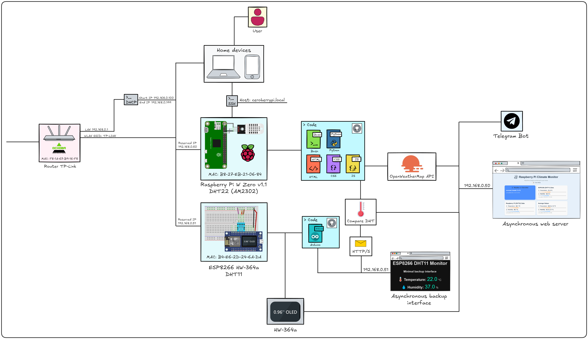
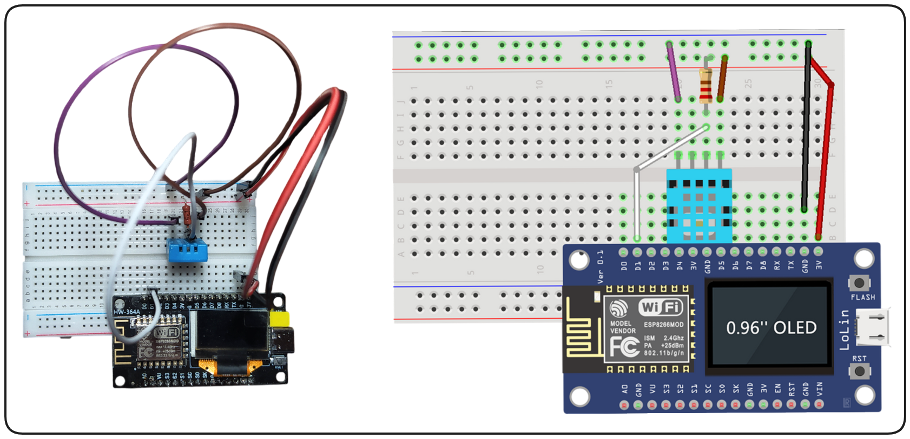
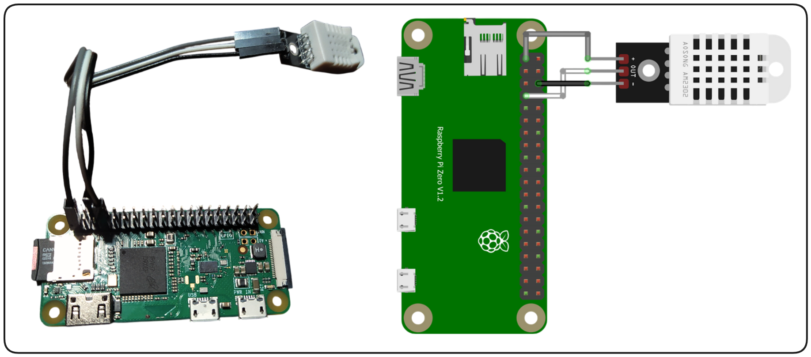
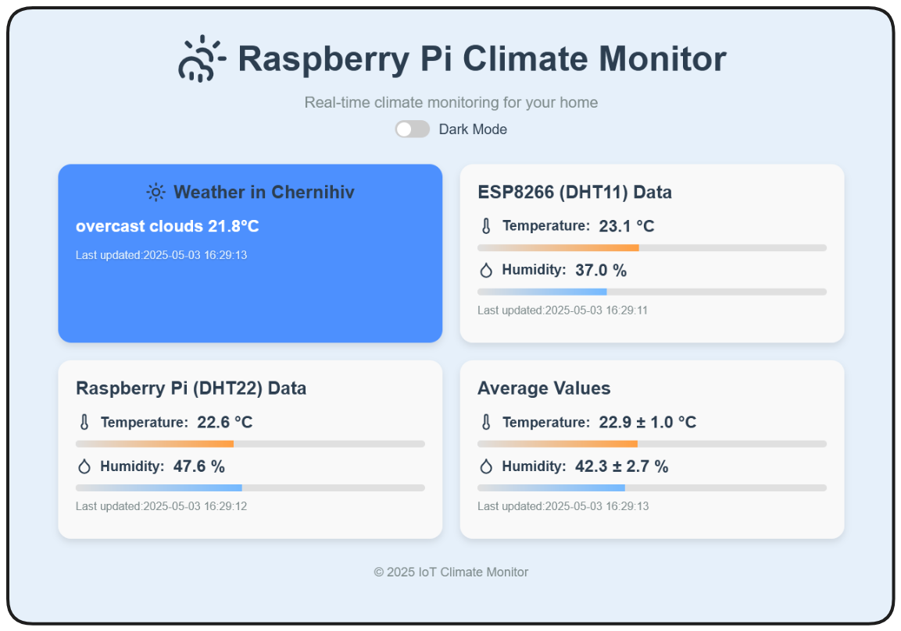
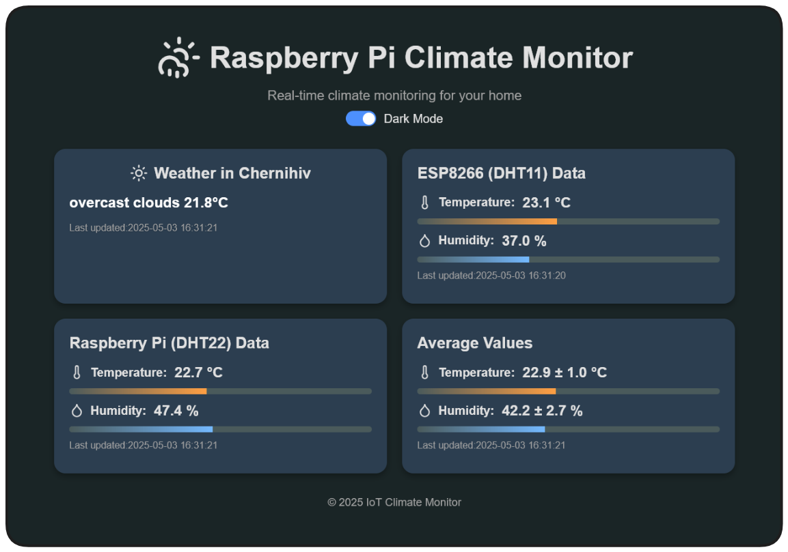
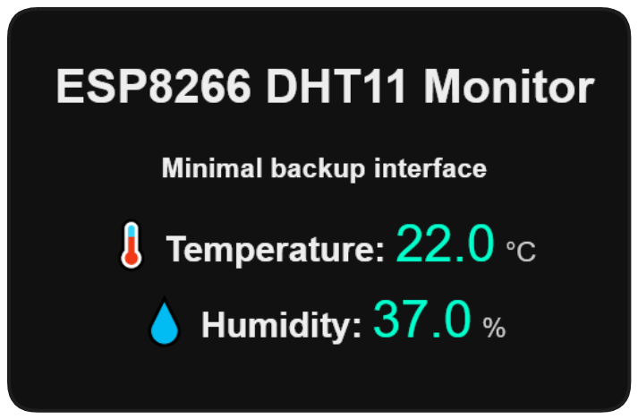
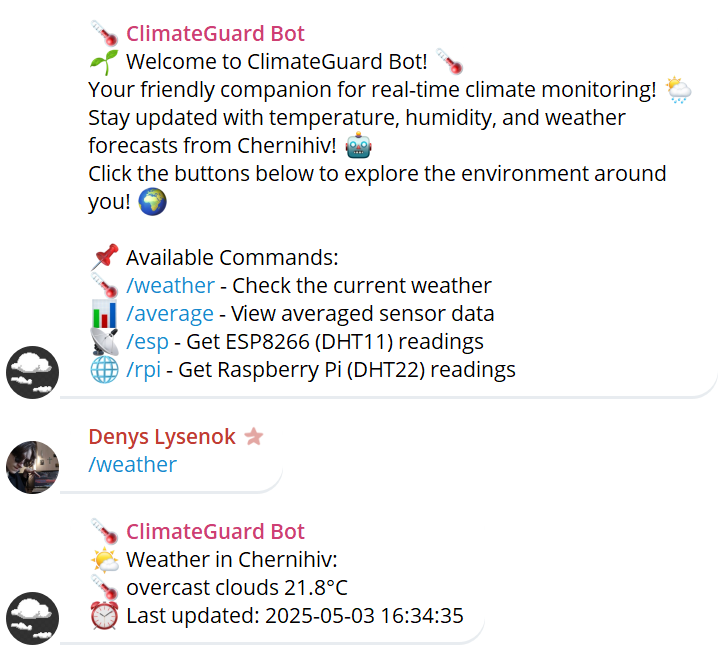
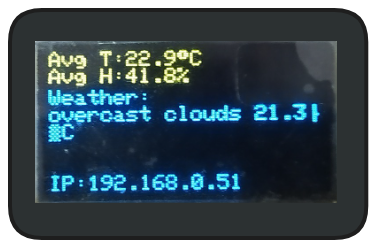

# 🌱 ClimateGuard-IoT

🌡️ *ClimateGuard-IoT* is an IoT-based climate monitoring system designed for real-time tracking of temperature and humidity using Raspberry Pi Zero W and ESP8266 HW-364a. Featuring a web interface with live updates, a Telegram bot for remote access, and an OLED display for local visualization, this project combines hardware and software to deliver a seamless monitoring experience.

**Institution**: National University "Chernihiv Polytechnic"

**Faculty**: Educational and Scientific Institute of Electronic and Information Technologies

**Specialty**: 123 Computer Engineering, 3rd Year  

**GitHub**: [@cerobreath](https://github.com/cerobreath) | Collaborator: [@Anna-Ackerman](https://github.com/Anna-Ackerman)

---

## 🌍 Introduction

### 🎯 Purpose
- Real-time monitoring of temperature and humidity via IoT devices.
- Study networked communication and data processing in an IoT context.

### 📡 Network Interaction
- Implement Wi-Fi-based communication (HTTP) between ESP8266 and Raspberry Pi.
- Explore data exchange protocols for IoT applications.

### 📊 Data Processing
- Calculate average values between DHT11 (ESP8266) and DHT22 (Raspberry Pi) sensors with error margins using root mean square (RMS) method.

### 🖥️ User Interfaces
- Asynchronous web server (`aiohttp`) for live data access with updates every 5 seconds.
- Telegram bot for remote monitoring with weather forecasts.
- Local OLED display on ESP8266 for data visualization.

---

## 🛠️ Hardware Components

### ESP8266 HW-364a
- 📱 Microcontroller with built-in Wi-Fi and a 0.96" OLED display (SSD1306, 128x64) for local data visualization.
- 🌐 Designed for IoT applications with wireless connectivity.

### 🌡️ DHT11 Sensor
- **Specs**: Temperature (0…50 °C, ±2 °C), Humidity (20…80%, ±5% RH).
- **Size**: 15.5×12×5.5 mm.
- **Power**: 3.3–5.5 V, max current 2.5 mA.
- **Frequency**: 1 Hz.
- **Pins**: 4 (pitch 2 mm).
- ⚙️ Paired with a 4.7 kΩ pull-up resistor for signal stability.

### 🍓 Raspberry Pi Zero W v1.1
- 💻 Compact single-board computer with Wi-Fi for data processing and hosting the web server.

### 🌡️ AM2302 (DHT22) Sensor
- **Specs**: Temperature (-40…80 °C, ±0.5 °C), Humidity (0…100%, ±2% RH).
- **Size**: 35×21×10 mm.
- **Power**: 3.3–5.5 V.
- ⚙️ High-precision sensor for Raspberry Pi.

---

## 🎨 Architecture
  
*ClimateGuard-IoT system architecture showing the flow of data between components.*

The architecture of *ClimateGuard-IoT* is designed to enable seamless communication between hardware and software components for real-time climate monitoring. Below is a detailed breakdown of the system:

- **Devices**:
    - **ESP8266 HW-364a (DHT11)**: Collects temperature and humidity data using the DHT11 sensor. It communicates via HTTP POST requests to the Raspberry Pi and displays averaged data on its built-in 0.96" OLED (SSD1306). It also hosts a minimal backup web interface at `192.168.0.51`.
    - **Raspberry Pi Zero W v1.1 (DHT22)**: Acts as the central hub, collecting data from its DHT22 (AM2302) sensor and the ESP8266. It hosts an asynchronous web server (`aiohttp`) at `192.168.0.50` and runs a Telegram bot for remote access.

- **Network**:
    - Both devices connect to a local Wi-Fi network (TP-Link router, SSID: TP-LINK) using static IPs:
        - ESP8266: `192.168.0.51`.
        - Raspberry Pi: `192.168.0.50`.
    - Communication between ESP8266 and Raspberry Pi uses **HTTP/JSON** for data exchange.
    - The Raspberry Pi connects to external services (OpenWeatherMap API and Telegram Bot API) via HTTPS.

---

## 🚀 Features
### 🌡️ Climate Monitoring
- Real-time temperature and humidity tracking using DHT11 (ESP8266) and DHT22 (Raspberry Pi).
- Average values calculated with error margins (RMS method).

### 🌦️ Weather Updates
- Fetch weather data for Chernihiv (configurable) via OpenWeatherMap API.

### 📱 Telegram Bot
- **Commands**:
    - `/start`: Welcome message with instructions.
    - `/weather`: Current weather in Chernihiv.
    - `/average`: Averaged sensor data with error margins.
    - `/esp`: ESP8266 (DHT11) readings.
    - `/rpi`: Raspberry Pi (DHT22) readings.
- Styled with emojis and formatted messages for better UX.
- Alerts every 10 minutes if ESP8266 is offline.

### 🌐 Web Interface (Raspberry Pi)
- Live updates every 5 seconds via `aiohttp`.
- Displays:
    - Weather in Chernihiv.
    - ESP8266 (DHT11) data with progress bars.
    - Raspberry Pi (DHT22) data with progress bars.
    - Averaged values with error margins.
- Features:
    - Dark mode toggle with localStorage persistence.
    - Responsive design for mobile devices.
    - Progress bars for temperature (0–50 °C) and humidity (0–100%).
    - Uses Lucide Icons for a modern look.

### 📺 OLED Display (ESP8266)
- Shows averaged temperature, humidity, and weather when Raspberry Pi is online.
- Fallback mode: Displays local DHT11 data if Raspberry Pi is offline.
- Displays local IP address for easy access.

### 🌐 Backup Web Server (ESP8266)
- Minimal web interface hosted on ESP8266 (`ESPAsyncWebServer`).
- Displays local temperature and humidity with updates every 10 seconds.

### 🔄 System Integration
- Autostart on Raspberry Pi via Systemd.
- Static IP configuration on ESP8266 for network stability.
- Periodic ESP8266 status checks with Telegram alerts.

### 📝 Logging
- Rotating log files (1 MB, 5 backups) with timestamps.
- Logs sensor readings, errors, and system events.

---

## 📸 Screenshots
### Wiring Schematics
  

  

### Web Interface (Raspberry Pi)
  

  


### Backup Web Interface (ESP8266)
  


### Telegram Bot


### OLED Display


---

## 🛠️ Installation and Setup

### 📦 Prerequisites
- **Hardware**:
    - Raspberry Pi Zero W.
    - ESP8266 HW-364a.
    - DHT11 sensor (ESP8266).
    - DHT22 (AM2302) sensor (Raspberry Pi).
    - 4.7 kΩ resistor for DHT11.
- **Software**:
    - Raspberry Pi OS (Debian-based).
    - Python 3, `pip`.
    - Arduino IDE with ESP8266 board support.
    - Libraries: `ESPAsyncWebServer`, `ESPAsyncTCP`, `ArduinoJson`, `Adafruit_SSD1306`, `DHT sensor library`, `Adafruit_GFX`, `requests`, `aiohttp`, `python-telegram-bot`, `RPi.GPIO`, `Adafruit_DHT`.

### 🍓 Raspberry Pi Setup
1. **Clone the Repository**:
   ```bash
   sudo git clone https://github.com/cerobreath/ClimateGuard-IoT.git /opt/ClimateGuard-IoT
   ```

2. **Set Up Virtual Environment**:
   ```bash
   cd /opt/ClimateGuard-IoT
   sudo python3 -m venv venv
   source venv/bin/activate
   pip install --upgrade pip
   pip install requests aiohttp python-telegram-bot==13.15 RPi.GPIO Adafruit_DHT
   deactivate
   ```

3. **Configure API Keys**:
    - Edit `src/rpi/server.py`:
        - Replace `YOUR_OPENWEATHERMAP_API_KEY` with your OpenWeatherMap API key.
        - Replace `YOUR_TELEGRAM_BOT_TOKEN` with your Telegram Bot Token.
        - Replace `YOUR_CHAT_ID` with your Telegram Chat ID.
        - Replace `YOUR_CITY` with your city (e.g., `Chernihiv`).
    - Edit `src/esp8266/main.ino`:
        - Replace `YOUR_SSID` and `YOUR_PASSWORD` with your Wi-Fi credentials.
        - Update `192.168.0.50` to your Raspberry Pi IP.

4. **Set Up Systemd Service**:
   ```bash
   sudo nano /etc/systemd/system/climateguard.service
   ```
   Add:
   ```
   [Unit]
   Description=ClimateGuard IoT Monitoring Service
   After=network-online.target
   Wants=network-online.target

   [Service]
   Type=simple
   User=root
   WorkingDirectory=/opt/ClimateGuard-IoT/src/rpi
   ExecStart=/opt/ClimateGuard-IoT/venv/bin/python /opt/ClimateGuard-IoT/src/rpi/server.py
   Restart=always
   RestartSec=10

   [Install]
   WantedBy=multi-user.target
   ```
   Enable and start:
   ```bash
   sudo systemctl daemon-reload
   sudo systemctl enable climateguard.service
   sudo systemctl start climateguard.service
   ```

5. **Verify**:
   ```bash
   sudo systemctl status climateguard.service
   ```
   Access the web interface at: `http://<RPi_IP>:80`.

### 🌐 ESP8266 Setup
1. **Install Libraries**:
    - Arduino IDE: Add ESP8266 board support.
    - Install: `ESPAsyncWebServer`, `ESPAsyncTCP`, `ArduinoJson`, `Adafruit_SSD1306`, `DHT sensor library`, `Adafruit_GFX`.

2. **Upload Firmware**:
    - Open `src/esp8266/main.ino` in Arduino IDE.
    - Select your board and upload.

3. **Check OLED and Web Interface**:
    - Ensure the OLED displays data.
    - Access the backup web interface at `http://<ESP8266_IP>`.

---

## 💻 Technologies
- **Hardware**:
    - ESP8266 HW-364a with built-in OLED.
    - Raspberry Pi Zero W.
    - DHT11, DHT22 (AM2302) sensors.
- **Software**:
    - **Python**: `asyncio`, `aiohttp` (web server), `python-telegram-bot==13.15`, `Adafruit_DHT`.
    - **Arduino C++**: `ESPAsyncWebServer`, `ESPAsyncTCP`, `ArduinoJson`, `Adafruit_SSD1306`, `DHT`.
    - **Web**: HTML/CSS/JavaScript, Lucide Icons.
- **Protocols**: HTTP, JSON.
- **APIs**: OpenWeatherMap, Telegram Bot API.
- **Tools**: Systemd, Git, Arduino IDE.

---

## 📝 Logger
- **Location**: `/opt/ClimateGuard-IoT/log/climateguard.log`.
- **Features**:
    - Rotating logs (1 MB, 5 backups).
    - Timestamps for readability.
    - Logs sensor readings, system events, and errors.
- **Check**:
  ```bash
  tail -f /opt/ClimateGuard-IoT/log/climateguard.log
  ```

---

## 🤖 Telegram Bot
- **Commands**:
    - `/start`: Welcome message with instructions.
    - `/weather`: Current weather in Chernihiv.
    - `/average`: Averaged sensor data with error margins.
    - `/esp`: ESP8266 (DHT11) readings.
    - `/rpi`: Raspberry Pi (DHT22) readings.
- **Features**:
    - Styled responses with emojis and formatting.
    - Alerts every 10 minutes if ESP8266 is offline.
- **Example Output**:
  ```
  📈 Average Climate Data:
  🌡️ Temperature: 22.5 ± 1.1 °C
  💧 Humidity: 55.0 ± 3.5 %
  ⏰ Last updated: 2025-05-03 12:34:56
  ```

---

## 🐛 Troubleshooting
- **Raspberry Pi**:
    - Ensure internet access for API and Telegram.
    - Check permissions:
      ```bash
      sudo chown -R root:root /opt/ClimateGuard-IoT
      sudo chmod -R 755 /opt/ClimateGuard-IoT
      ```
    - Logs:
      ```bash
      journalctl -u climateguard.service
      ```
- **ESP8266**:
    - Verify Wi-Fi and Raspberry Pi IP.
    - Check serial monitor in Arduino IDE for errors.

---

## 🤝 Contributing
Fork this repo, submit issues, or create PRs. Contributions are welcome! 🌟

---

## 📜 License
MIT License - See [LICENSE](LICENSE) file.

---

## 🙌 Acknowledgments
- [OpenWeatherMap](https://openweathermap.org/)
- [Telegram Bot API](https://docs.python-telegram-bot.org/en/stable/index.html)
- Adafruit and Arduino communities for libraries and support.
